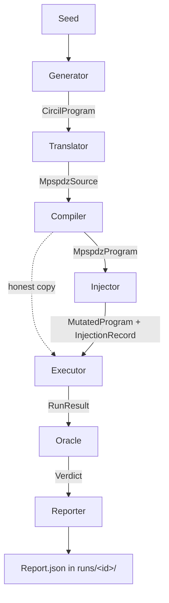

# Architecture Blueprint

## Overview

Generate an MPC program, lower to MP-SPDZ source, compile to an
in-memory program IR, take a copy and insert a local-only gadget on
the corrupt party, materialize both copies to disk, launch the
parties, twin-run, classify the outputs.



## Substrate decision: IR, not strings, not raw bytecode

Fault injection happens on **MP-SPDZ's compiler IR**, after
compilation, before execution. Compile once to an in-memory
`Compiler.program.Program` object; deep-copy it; insert a gadget into
the copy. Both copies emit `.bc`/`.sch` files at the Executor stage.

Why this layer and not the alternatives:
- **Not source strings.** Textual rewrites are fragile — formatting,
  scoping, identifier capture. The compiler is right there; use it.
- **Not raw bytecode.** Parsing `.bc` ourselves duplicates compiler
  knowledge: register allocation, tape schedules, label resolution.
  The IR already has all of that.
- **MP-SPDZ's IR is Python.** `Compiler.program.Program.tapes[i].instructions`
  is a list of `Instruction` objects. Mutating it is a list splice.

Two `.bc` files come out of one run: the honest one and the mutated
one. Corrupt parties load the mutated bytecode; honest parties load
the honest bytecode.

## Scope: gadget insertion only

The Injector inserts a block of **local-only instructions** between
two consecutive sync points on each corrupt party's tape. The gadgets
run only on those parties; honest parties see no extra network
traffic, so synchronization is preserved by construction.

Anything that touches MAC tags, removes / moves compiler-emitted
CHECKs, or otherwise breaks the network trace is out of scope here
— those need a different substrate (protocol layer, raw bytecode,
or runtime patching). Additive future work, not a redesign.

Gadget templates (Injector picks one per run):
- **Drift-and-restore:** $s \leftarrow s + \delta$, then $s \leftarrow s - \delta$.
- **Single-variable bump:** $s \leftarrow s + c$.
- **Linear combination:** $s \leftarrow s + a \cdot t + b \cdot u$.
- **Permute:** $s \leftrightarrow t$.
- **Zero-and-recompute:** $s \leftarrow 0$; rebuild $s$ from other registers.

Local-only opcode whitelist for gadget bodies (no `Player::` calls):
ADDS, SUBS, ADDSI, SUBSI, MULSI, MOVS, LDMS, STMS, clear arithmetic,
JMP, JMPNZ. Forbidden inside a gadget: MULS, OPEN, INPUT, CHECK,
TRUNC_PR, DABIT, EDABIT. *The whitelist is a claim, not a fact* —
audit each candidate against `Processor/Instruction.hpp` before we
ship the injector.

## Protocol target

Step 1 targets **`mascot-party.x`** — MP-SPDZ's name for SPDZ-family
malicious dishonest-majority with OT-based offline and SPDZ-style
information-theoretic MACs. It's the canonical "SPDZ" in MP-SPDZ.
`spdz2k-party.x` (same online phase over Z_{2^k}) is the natural
follow-up. LowGear / HighGear use FHE-based offline (extra setup),
deferred.

## Threat model: within-threshold corrupt-set sampling

Each protocol family in MP-SPDZ defines a corruption threshold `t`:
- **Dishonest-majority malicious** (`mascot`, `spdz2k`, ...): `t ≤ n-1`.
  Security holds as long as at least one party is honest.
- **Honest-majority malicious** (`malicious-shamir`, `malicious-rep-*`,
  ...): `t < n/2`. Strictly more than half the parties must be honest.

The harness **always stays within `t`**. Going outside is meaningless:
the protocol gives no guarantee, so silent wrong outputs are expected,
not bugs.

Corrupt set is a **sampled parameter**, not a scoping restriction.
For each `(protocol, n)` configuration, the harness draws non-empty
subsets `S ⊆ {0..n-1}` with `|S| ≤ t` — uniform over `S` for v1,
coverage-guided later. Combinatorial growth in `|S|` is *the workload
of a fuzzer*, not a constraint to design around.

**For now, all parties in `S` run the same mutated bytecode** — one
gadget choice, one insertion point, applied uniformly. Per-party
gadget variation and coordinated collusion are future work.

For step 1 (`mascot`, `n=2`, `t=1`) the only non-empty corrupt set
has size 1, so the "shared mutated bytecode" simplification has no
visible effect yet — but the design and types already accommodate
arbitrary `S` so step 2+ doesn't require a refactor.

## Components

### 1. Generator

**In:** `Seed`.
**Out:** `CircilProgram`.

Wraps `python-circil`'s program generator: pick a seed-derived
program from the IR-language fuzzer.

### 2. Translator

**In:** `CircilProgram`.
**Out:** `MpspdzSource` (MP-SPDZ Python DSL).

CircIL types (`Field`, `Bool`, `Array`) map to MP-SPDZ types
(`sint`, `sfix`, `sintbit`). Reveal / I/O operations are introduced
here. Pure function.

### 3. Compiler

**In:** `MpspdzSource`.
**Out:** `MpspdzProgram` — wraps MP-SPDZ's `Compiler.program.Program`.

Imports MP-SPDZ's `Compiler` Python module directly (no subprocess).
The result is an in-memory object whose `.tapes[i].instructions` we
can read and splice.

### 4. Injector

**In:** `MpspdzProgram`, `Seed`.
**Out:** `MutatedProgram` (original IR, one mutated IR, and the
`InjectionRecord`).

Per run:
1. Walk every tape; identify sync-point PCs (any opcode whose handler
   calls a `Player::` method — MULS, OPEN, CHECK, INPUT, TRUNC_PR,
   etc.).
2. Pick a tape and a `(sync_lo_pc, sync_hi_pc)` gap (seeded random).
3. Pick a gadget template (seeded random).
4. Generate the gadget over registers live in that gap.
5. Splice the gadget into a copy of the IR.
6. Emit the `InjectionRecord` (gadget_kind, tape_index, sync_lo_pc,
   sync_hi_pc).

The corrupt set `S` is chosen by the pipeline driver, not the
Injector — `S` only determines which parties *load* the mutated
bytecode at execution time, not what the mutation is.

Propagation filter (backward def-use slice from OPEN/CHECK) is a
future optimization; v1 mutates uniformly random gaps.

### 5. Executor

**In:** `MutatedProgram`, `n_parties: int`, `corrupt_parties: frozenset[int]`.
**Out:** `RunResult`.

1. Materialize honest `.bc`/`.sch` into `runs/<id>/honest/Programs/`
   and the mutated copy into `runs/<id>/mutated/Programs/`.
2. Launch `n_parties × mascot-party.x` twice:
   - **Honest twin:** every party reads from `honest/`. Reference
     output.
   - **Mutated twin:** every party `p ∈ corrupt_parties` reads from
     `mutated/`; the rest read from `honest/`.
3. Hard timeout per run (default 30s).
4. Capture each party's stdout, stderr, exit code into a
   `PartyOutput`.

### 6. Oracle

**In:** `RunResult`.
**Out:** `Verdict`.

| Mutated run aborted? | Output matches honest twin? | Verdict |
|---|---|---|
| Yes (`mac_fail` / `consistency_check_fail`) | N/A | **pass** (caught) |
| No | Yes | **pass** (no-op fault) |
| No | No | **BUG** (silent divergence) |
| Crashed / timed out / segfault | N/A | **inconclusive** |

"Aborted" is detected from MP-SPDZ's exception strings on stderr.
Abort sites: `Protocols/MAC_Check.hpp:197`,
`Protocols/SecureShuffle.hpp:318`. Exception types:
`Tools/Exceptions.h`.

### 7. Reporter

**In:** `Verdict`, `InjectionRecord`, `RunResult`.
**Out:** `Report`. Persisted as `runs/<id>/report.json`.

Bugs accumulate in `runs/bugs.jsonl`; passes in `runs/passes.jsonl`.

## Working directory layout

Every run gets a fresh `runs/<id>/` directory (gitignored):

```
runs/<id>/
  honest/Programs/Bytecode/<prog>.bc
  honest/Programs/Schedules/<prog>.sch
  mutated/Programs/Bytecode/<prog>.bc       # shared by all corrupt parties
  mutated/Programs/Schedules/<prog>.sch
  honest_run/party_<i>.{stdout,stderr}
  mutated_run/party_<i>.{stdout,stderr}
  injection.json    # InjectionRecord + corrupt_parties
  report.json       # Verdict + summary
```

In-tree (not `/tmp`, not `~/.cache`) because runs are cheap to keep
and easier to inspect when debugging.

## Development invariants

**The pipeline is always executable, end-to-end.**
At every point in development, `uv run python main.py` runs.
Components start as stubs that print what they would do
and pass dummy data forward.
Real logic replaces stubs one at a time.
The pipeline never stops working.

**Interfaces are strict.**
Every component declares exactly what it takes in
and what it produces — as typed dataclasses.
If an interface changes, the pipeline breaks immediately,
not silently.
Enforced by `uv run mypy` (strict mode in `pyproject.toml`).

**No separate test suite (for now).**
The pipeline *is* the test.
If a component produces the wrong type or shape,
the next component rejects it at the boundary.
Correct-by-construction, enforced by the type system
and the fact that the pipeline runs end-to-end on every change.
If unit tests become necessary later, it will be for
component-internal logic (e.g., "does the injector correctly
identify synchronization points in this IR?"),
not for integration.

## What to build first

1. **Plumbing milestone.** Compile a hand-written MP-SPDZ program;
   run `mascot-party.x` × 2 from Python (`n=2`, `t=1`, single
   corrupt set `{1}`); capture stdout. No injection yet — confirm we
   can drive MP-SPDZ end-to-end. *This validates the entire approach.
   If this doesn't work, nothing else matters.*
2. **Injector.** One gadget template (drift-and-restore), one
   selection strategy (uniform-random gap on tape 0).
3. **Oracle + Reporter.** Twin-run, classify, write `report.json`.
4. **Generator integration.** Replace hand-written program with
   `python-circil`-generated programs.
5. **Gadget coverage.** Add the other four templates.
6. **Feedback loop.** Coverage / verdict-guided generation. Last.
