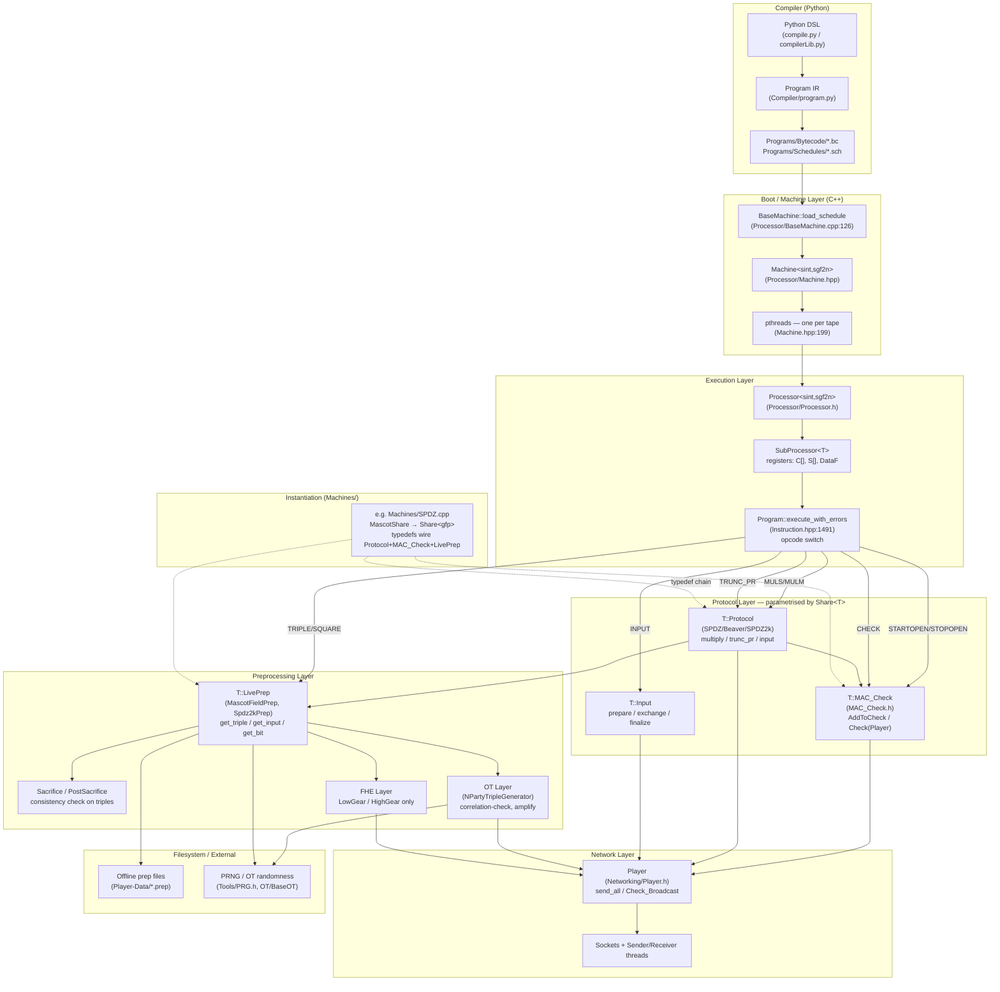

# MP-SPDZ: modular architecture map

WHY: orient before picking injection points. The diagram below is the
boundary map; the bytecode dispatcher is the EXEC↔PROTO seam, which is
where fault injection lives.

## Diagram

## Legend

| Box | Responsibility |
|---|---|
| Python DSL / Program IR | User writes `sint` arithmetic; compiler lowers to fixed IR |
| Bytecode + Schedules | Protocol-agnostic `.bc`/`.sch` artifacts on disk |
| BaseMachine::load_schedule | Reads `.sch`, opens `.bc`, sizes register banks |
| Machine | Owns thread pool, prep buffers, main run loop |
| SubProcessor\<T\> | Per-thread register file: clear `C[]`, secret `S[]`, prep `DataF` |
| Program::execute_with_errors | Opcode-dispatch switch — every instruction resolves here |
| T::Protocol | Online `multiply`, `trunc_pr`, `input`; called directly from opcodes |
| T::MAC_Check | Accumulates opened shares; `Check(Player)` broadcasts + aborts on fail |
| T::Input | Mask from prep → opened → reconstructed |
| T::LivePrep | Serves triples/bits/inputs from buffer or generates them online |
| Sacrifice / OT / FHE | Malicious-only paths into the prep buffer |
| Machines/*.cpp | Single TU instantiating `Machine<Share<…>, …>` → one party binary |
| Player / Sockets | Authenticated p2p + `Check_Broadcast` consistency channel |

**Threading is cross-cut, not a box**: one `pthread` per tape, each with
its own `SubProcessor` over a shared `Player` and shared prep-file
cursor. Forcing it into a layer would be dishonest.

## Where fault injection touches this map

Injection point — `Program::execute_with_errors`
(`Processor/Instruction.hpp:1491`) — is the EXEC↔PROTO boundary. Every
arrow leaving DISPATCH is a candidate mutation site. Corrupting `S[]`
before MULS fires, or silently no-oping the `TRUNC_PR → protocol.trunc_pr`
edge, stays inside EXEC and never touches PROTO or NET — round counts
and message volumes match across parties, preserving the
synchronisation invariant.

CHECK resolves via `Processor::check()` → `MC.Check(Player)`. The
Rushing-at-SPDZ truncation bug is exactly the case where the TRUNC_PR
edge fires but the CHECK edge does not — and the diagram makes that
gap structural: TRUNC_PR and CHECK are separate opcode edges, so
skipping one while preserving the other is a one-line injector change.

## Anchor files

- `MP-SPDZ/Processor/Instruction.hpp` — dispatch switch + opcode→protocol edges
- `MP-SPDZ/Processor/Processor.hpp` — `check()` → `protocol.check()` → `MC.Check(P)`
- `MP-SPDZ/Processor/Machine.hpp` — thread spawn, schedule load, prep-buffer fill
- `MP-SPDZ/Processor/BaseMachine.cpp` — `load_schedule` reading `.sch`/`.bc`
- `MP-SPDZ/Protocols/Share.h` — `MascotShare` typedef chain
- `MP-SPDZ/Protocols/Spdz2kShare.h` — same chain for Z_{2^k}
- `MP-SPDZ/Protocols/MAC_Check.h` — `Tree_MAC_Check`, `Check(Player)`
- `MP-SPDZ/Protocols/MascotPrep.h` — `MascotTriplePrep`, `MascotFieldPrep`
- `MP-SPDZ/Machines/SPDZ.hpp` + `SPDZ.cpp` — instantiation into `mascot-party.x`
- `MP-SPDZ/Networking/Player.h` — `Player`, `CommStats`, `Check_Broadcast`
