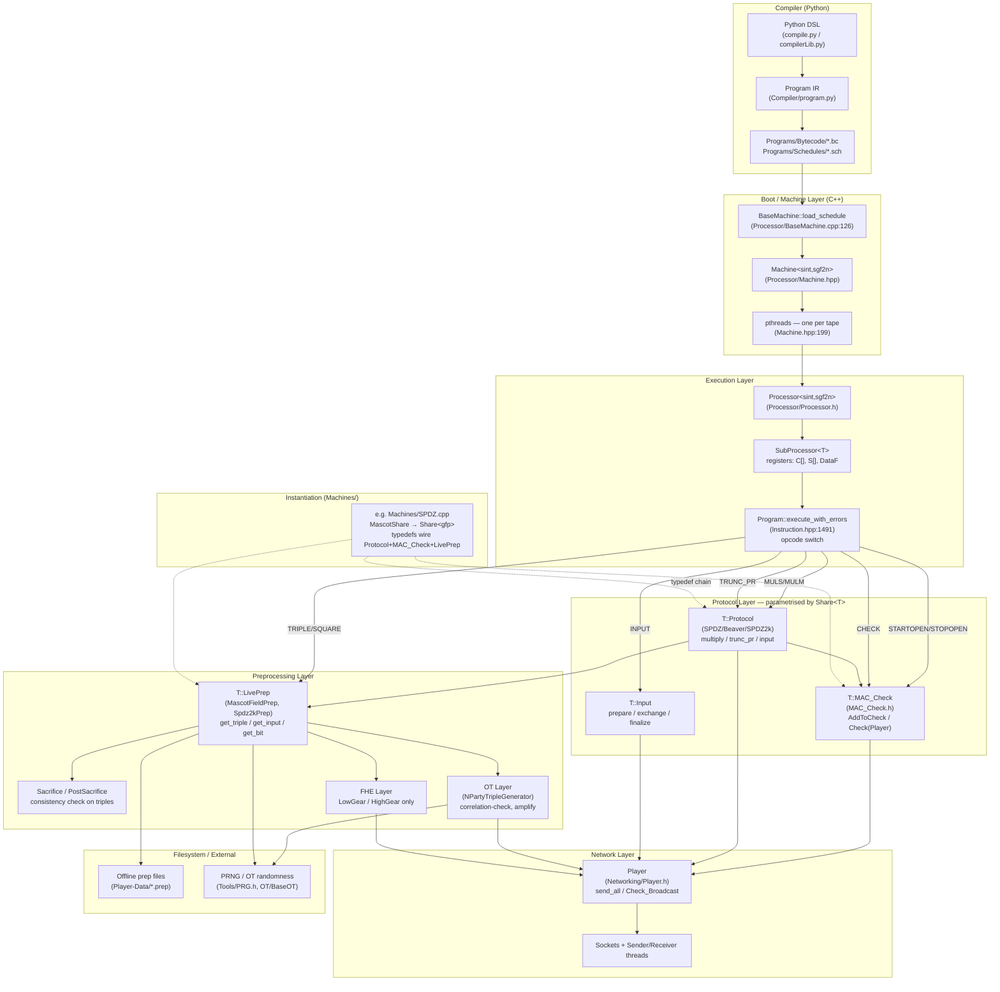

# MP-SPDZ

WHY: orient before picking injection points. The bytecode
dispatcher is the EXEC↔PROTO seam — that's where fault injection
lives.

## Architecture



| Box | Responsibility |
|---|---|
| Python DSL / Program IR | Lowers `sint` arithmetic to fixed IR |
| Bytecode + Schedules | Protocol-agnostic `.bc`/`.sch` on disk |
| Machine | Owns thread pool, prep buffers, run loop |
| SubProcessor\<T\> | Per-thread reg file: `C[]`, `S[]`, `DataF` |
| `Program::execute_with_errors` | Opcode-dispatch switch — every instruction here |
| T::Protocol | Online `multiply`, `trunc_pr`, `input` |
| T::MAC_Check | Accumulates opens; `Check(Player)` aborts on fail |
| T::LivePrep | Triples/bits/inputs from buffer or live gen |
| Sacrifice / OT / FHE | Malicious-only paths into prep |
| Machines/*.cpp | Single TU → one party binary |
| Player | Authenticated p2p + `Check_Broadcast` |

Threading is cross-cut, not a layer: one `pthread` per tape,
each with its own `SubProcessor` over a shared `Player` and
shared prep-file cursor.

## Where fault injection touches this map

Injection lives at the EXEC↔PROTO boundary —
`Program::execute_with_errors`
(`Processor/Instruction.hpp:1491`). Every arrow leaving DISPATCH
is a candidate mutation site. Corrupting `S[]` before MULS, or
no-oping the `TRUNC_PR → protocol.trunc_pr` edge, stays inside
EXEC and never touches PROTO or NET — round counts and message
volumes match across parties, preserving the synchronisation
invariant.

CHECK resolves via `Processor::check()` →
`MC.Check(Player)`. The Rushing-at-SPDZ truncation bug is
exactly the case where the TRUNC_PR edge fires but the CHECK
edge does not — the diagram makes the gap structural, so
skipping one while preserving the other is a one-line injector
change.

## What malicious security adds (the attack surface)

Every secret $x$ carries a MAC $\gamma(x) = \alpha \cdot x$
under a global key $\alpha$ that no party knows in full.
Per the README, Semi/Semi2k = MASCOT/SPDZ2k with these stripped:
amplifying, sacrificing, MAC generation, OT correlation checks.
That stripped set is the fault-injection target. Concretely:

- **MAC checks** — opening a value must be followed by
  `MC.Check(Player)`. Missing/late check → silent wrong output.
  Rushing-at-SPDZ found a missing check around `TRUNC_PR`.
- **Sacrificing** — Beaver triples are verified by sacrificing
  a second triple. Skipping/corrupting this lets bad triples
  poison MULS.
- **OT correlation checks** — MASCOT's triple generation
  cross-checks OT outputs. Skip → unverified triples.
- **Opening sequence** — commit → open → MAC-check → release.
  Releasing before MAC-check is a thread-race attack vector.

## Grep recipes

Run from inside `MP-SPDZ/`.

```bash
# MAC check implementations
grep -rn "mac_check\|MAC_Check\|MacCheck" Protocols/ \
  --include="*.h" --include="*.cpp"

# Where opening happens
grep -rn "open\|Open\|reveal" Protocols/ \
  --include="*.h" --include="*.cpp" | head -40

# Sacrifice / amplify
grep -rn "sacrifice\|Sacrifice\|amplify\|Amplify" Protocols/ \
  --include="*.h" --include="*.cpp"

# Truncation (Rushing-at-SPDZ bug site)
grep -rn "trunc\|Trunc" Protocols/ Processor/ \
  --include="*.h" --include="*.cpp"

# Semi-honest vs malicious diff = the attack surface
diff Protocols/SemiShare.h Protocols/SpdzShare.h
diff Protocols/SemiMC.h    Protocols/MAC_Check.h
```

## Anchor files

- `Processor/Instruction.hpp` — dispatch switch + opcode→protocol
- `Processor/Processor.hpp` — `check()` → `protocol.check()` →
  `MC.Check(P)`
- `Processor/Machine.hpp` — thread spawn, schedule load,
  prep-buffer fill
- `Processor/BaseMachine.cpp` — `load_schedule` reading
  `.sch`/`.bc`
- `Protocols/Share.h` — `MascotShare` typedef chain
- `Protocols/Spdz2kShare.h` — same chain for $\mathbb{Z}_{2^k}$
- `Protocols/MAC_Check.h` — `Tree_MAC_Check`, `Check(Player)`
- `Protocols/MascotPrep.h` — `MascotTriplePrep`,
  `MascotFieldPrep`
- `Machines/SPDZ.hpp` + `SPDZ.cpp` — instantiation into
  `mascot-party.x`
- `Networking/Player.h` — `Player`, `CommStats`,
  `Check_Broadcast`
